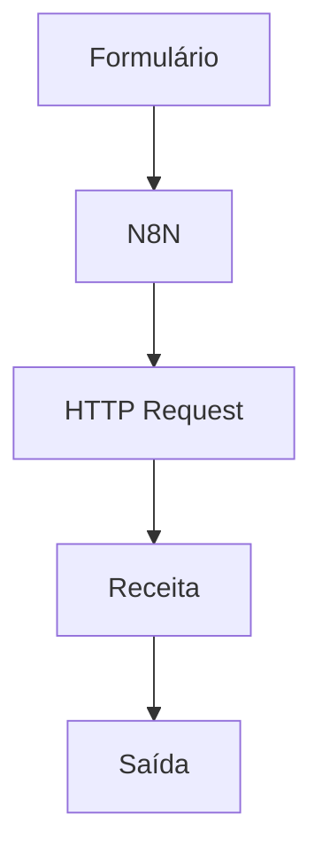

# Infusie 🍃 

## Sobre o Projeto
**Projeto:** Infusie

**Problema que resolve:** Dificuldade em escolher uma bebida (chá/infusão) reconfortante e adequada ao humor do usuário no dia a dia.

## Integrantes
| Nome | GitHub |
|------|--------|
| Luiza Leão | @lvluiza |
| Gabriela Delgado | @gabrieladelgadosaugo |
| Guilherme Benossi | @gguibenossi-boop  |

## Arquitetura

##  Como funciona ☕

> O usuário informa, através de um formulário fornecido pelo n8n, seu estado físico e emocional. A partir disso, o sistema envia essa informação por meio de um HTTP Request para o Groq, o qual com a assistência de uma API de chás e receitas e com o uso de inteligência artificial, cria criada uma receita adaptada e otimizada para a necessidade do momento. São fornecidas sempre duas opções (uma simplificada e outra completa), que são entregues diretamente ao usuário (saída), finalizando o fluxo do programa. Para casos de sintomas graves, a mensagem será destacada com uma advterência para assistência médica!
